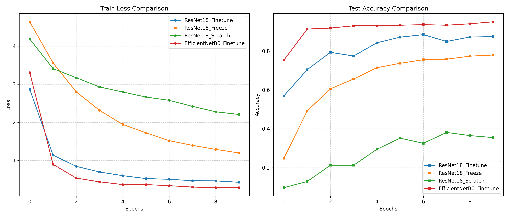

# Pokédex_AI: Intelligent Pokémon Classifier

전이 학습을 활용하여 150종의 포켓몬을 실시간으로 분류하고 관리하는 지능형 포켓몬 도감 프로젝트입니다. 다양한 딥러닝 백본 모델을 비교 실험하고, Streamlit을 통해 사용자 친화적인 GUI 환경을 구축했습니다.

## 1. 주요 기능 

* **Multi-Model Experimentation**: ResNet18(Fine-tuning, Freeze, Scratch)과 EfficientNet-B0를 포함한 4가지 실험 설정을 통해 최적의 모델을 산출합니다.
* **Mixed Precision Training**: `torch.amp`를 적용하여 학습 속도를 최적화하고 메모리 효율을 극대화했습니다.
* **Intelligent Pokedex GUI**: Streamlit 기반의 웹 인터페이스를 통해 이미지 업로드 및 URL 입력을 통한 실시간 포켓몬 판별 기능을 제공합니다.
* **Multi-Language Mapping**: 영어로 학습된 모델의 결과를 한국어 포켓몬 이름으로 자동 매핑하여 사용자 편의성을 높였습니다.

## 2. 실험 설정 및 성능 비교

학습 데이터셋은 Kaggle의 [7,000 Labeled Pokemon]을 사용하였으며, 동일한 하이퍼파라미터(`Batch: 128`, `Epoch: 10`, `LR: 0.001`) 하에 비교를 진행했습니다.

| Experiment Type | Description | Best Test Acc |
| :--- | :--- | :---: |
| **EfficientNetB0_Finetune** | **MBConv 기반의 고효율 모델 Fine-tuning** | **0.95+** |
| **ResNet18_Finetune** | Pre-trained 가중치 사용 및 전체 레이어 학습 | 0.88 |
| **ResNet18_Freeze** | Feature Extractor 고정, FC 레이어만 학습 | 0.78 |
| **ResNet18_Scratch** | 가중치 초기화 상태에서 전체 학습 | 0.38 |

### Learning Curve

### 결과 분석
* **최적 모델 선정**: 실험 결과, **`EfficientNetB0_Finetune`** 모델이 최종 Epoch에서 약 **95% 이상의 정확도**를 기록하며 가장 우수한 성능을 보였습니다. 
* **전이 학습(Transfer Learning)의 위력**: 가중치 없이 학습한 `ResNet18_Scratch` 모델(약 38%)과 비교했을 때, 사전 학습된 모델을 활용한 경우 압도적인 수렴 속도와 높은 정확도를 보였습니다.
* **Fine-tuning 범위에 따른 차이**: 모든 레이어를 학습시킨 `ResNet18_Finetune`이 출력층만 학습시킨 `ResNet18_Freeze`보다 약 10%p 높은 성능을 보였으며, 이는 포켓몬 데이터의 도메인 특성에 맞춰 가중치를 재조정하는 과정이 효과적이었음을 증명합니다.
* **결론**: 최종적으로 정확도와 손실값(Loss) 모두에서 가장 뛰어난 지표를 보여준 **EfficientNetB0_Finetune** 모델을 서비스 모델로 채택했습니다.

---

## 3. 데모 GUI 시연 
### 시연 영상

https://github.com/user-attachments/assets/82e2b62c-00d6-4eb7-9b06-cfdf599244de

`Streamlit`을 활용하여 인공지능 모델을 실제 도감처럼 사용할 수 있는 인터페이스를 구현했습니다.

* **실시간 추론**: 학습된 최고 성능 모델(`EfficientNetB0`)을 로드하여 이미지 분석 결과를 즉시 출력합니다.
* **Top-5 Predictions**: 단순히 1위 결과만 보여주는 것이 아니라, 상위 5개 후보군을 확률과 함께 시각화하여 분석의 신뢰도를 높였습니다.
* **한국어 포켓몬 명칭**: 영어 기반 데이터셋의 한계를 극복하기 위해 별도의 매핑 사전을 구축, 한국어 이름을 병기하여 가독성을 개선했습니다.

